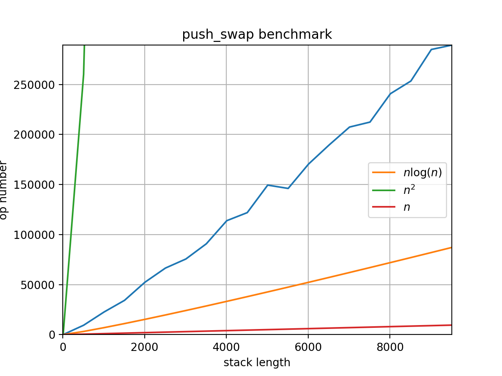
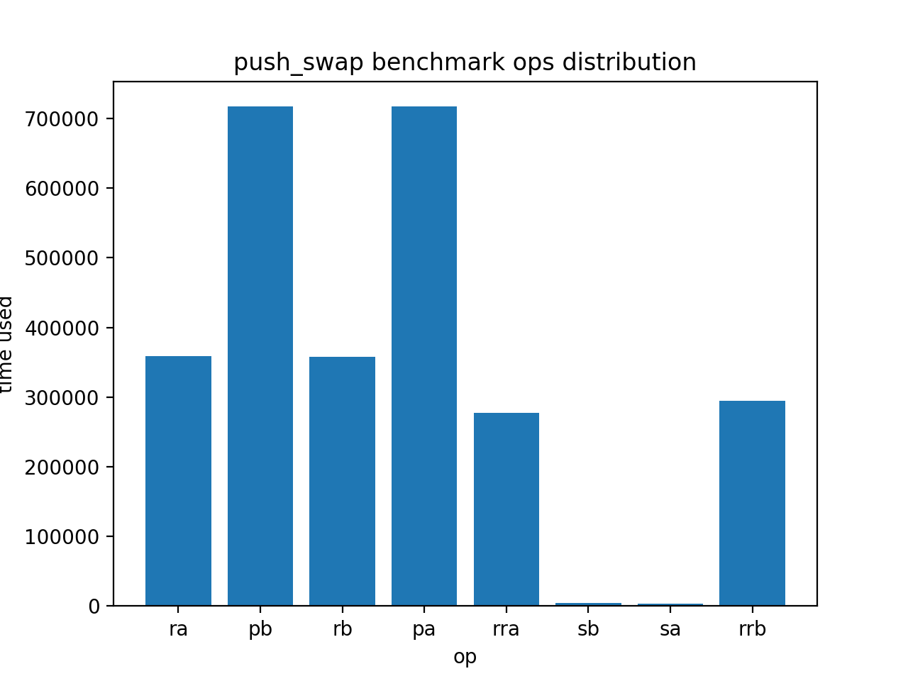

# push_swap  [](https://travis-ci.com/cacharle/push_swap)

push_swap project of school 42

# Goal

We have 2 stack at our disposal A and B.
Stack A is given has an argument to our program,
we have to sort it using only a limited set of operand.

* `sa` swap the 2 topmost element of A
* `sb` swap the 2 topmost element of B
* `ss` swap the 2 topmost element of A & B
* `pa` pop top of B and push it to A
* `pb` pop top of A and push it to B
* `ra` rotate A, everything is shifted up (top becomes bottom)
* `rb` rotate B
* `rr` rotate A & B
* `rra` reverse rotate A,
        everything is shifted down (bottom becomes top)
* `rrb` reverse rotate B
* `rrr` reverse rotate A & B

# Usage

```
make all
export ARG=$(echo ./random_stack.rb 1 20)
./push_swap $(echo $ARG) | ./checker $(echo $ARG)
```

# Visualizer

```
export ARG=$(echo ./random_stack.rb 1 20)
./push_swap $(echo $ARG) | ./visualizer.rb $(echo $ARG)
```

# Test

```
./test.sh 20 1 100
```

Test argument stack parsing

```
./test.sh --error
```

# Benchmark

Make sure to have Python3.6 >=



```
python benchmark.py 10 100 5 10
python benchmark_plot.py
```

Plot operation distribution



```
python benchmark_plot.py --dist
```
